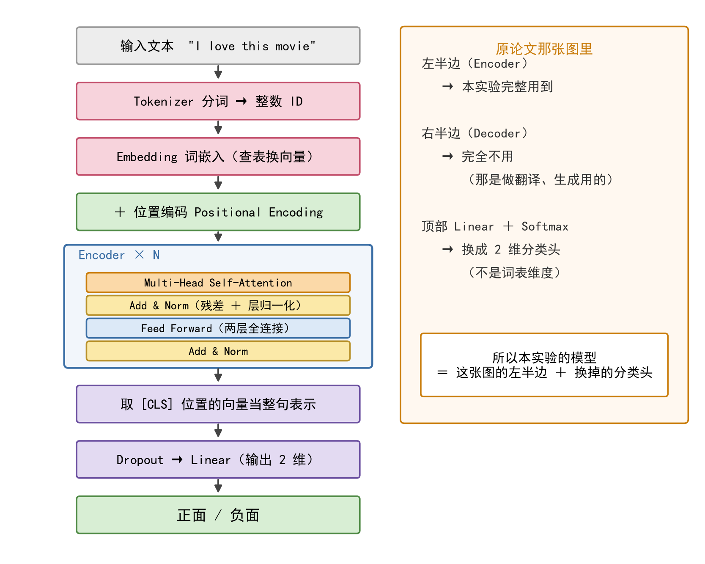
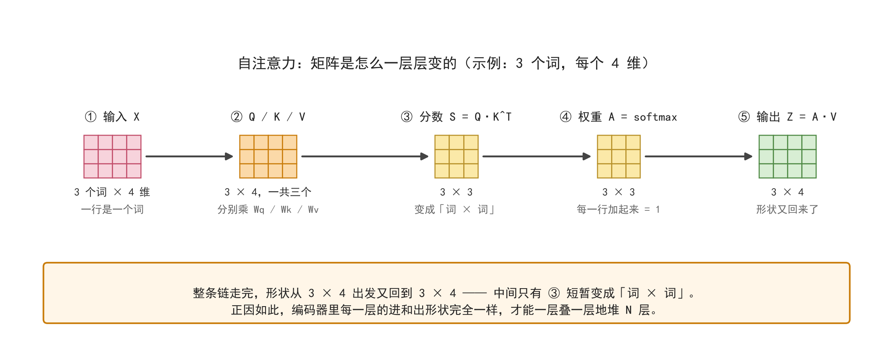
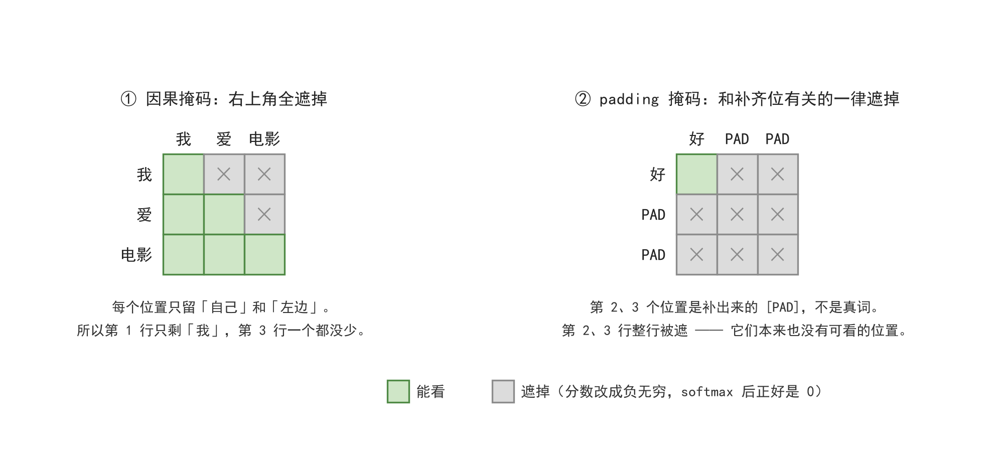

# Transformer 原理详解

> 本文讲的是 2017 年论文 *Attention Is All You Need* 提出的那套架构。它本身不是本实验的最终模型，而是后面 BERT、RoBERTa、DeBERTa 三节共同的骨架 —— **想看懂那三个模型，得先把这张图看懂**。
>
> 配套文档：
> - [02-BERT / RoBERTa / DeBERTa 原理详解](02-BERT-RoBERTa-DeBERTa原理详解.md)
> - [03-LoRA 原理详解](03-LoRA原理详解.md)

---

## 一、一句话概括

**Transformer 是一台"把句子里的每个词，根据它和其他所有词的关系，重新解释一遍"的机器。**

它做这件事的办法叫**自注意力（Self-Attention）**：对于句子里的每一个词，都去问"我和其他每一个词有多相关"，然后按相关程度把其他词的信息加权搬过来，拼成这个位置的新表示。

和它之前的两代做法对比一下就清楚了：

| | CNN | RNN / LSTM / GRU | Transformer |
| ---- | ---- | ---- | ---- |
| 一个词能看到谁 | 只看相邻几个词（卷积窗口） | 靠记忆一步步传过来 | **一次看到全句所有词** |
| 能不能并行 | 能 | **不能**，必须一个词一个词按顺序算 | **能**，所有位置同时算 |
| 远距离关系 | 得堆很多层才够得着 | 传得越远记得越模糊 | 任意两个词都是**一步直达** |
| 天生带来的假设 | 挨着的词有关系（局部性） | 词是一个一个按顺序来的（时序性） | **什么假设都不带**，全靠数据学 |

最后一行特别重要：Transformer 之所以在数据少的时候反而打不过 LSTM（本仓库里 GloVe + Transformer 只有 0.84184，比 GloVe + LSTM 的 0.89420 还低），根子就在这里 —— 它把前两代"与生俱来的常识"全扔了，什么都不假设。**不假设的好处是上限高，坏处是费数据。**

---

## 二、先看全貌：那张经典的架构图

下面这张就是原论文的 Figure 1：


> 图源：Vaswani et al., *Attention Is All You Need*, NeurIPS 2017, Figure 1。

这张图信息量很大，但读法只有三条：

1. **方向**：数据**从下往上**流。最下面是原始输入，最上面是输出概率。
2. **左右**：左边灰色大框是**编码器（Encoder）**，右边灰色大框是**解码器（Decoder）**。两者长得很像，但解码器多两块东西。
3. **`N×`**：框右边那个 `N×` 表示这一整块要**重复堆叠 N 层**。原论文 N = 6；BERT-base 堆 12 层，RoBERTa-large 堆 24 层，本实验用的 DeBERTa-v2-xxlarge 堆了 48 层。**"深"就是从这里来的。**

还有两个符号先认一下：

- **⊕**（圆圈里一个加号）= 逐元素相加；
- 那些**绕过方块的弧线** = 残差连接（Residual Connection），后面会讲它为什么是整张图的救命设计。

---

## 三、从下往上，一个方块一个方块拆

### （1）粉色方块：Input Embedding / Output Embedding —— 词嵌入

**做什么**：把上一步得到的整数 ID（比如 `[101, 1045, 2293, ...]`）通过一张查找表换成稠密向量。

**这张表长什么样**：行数 = 词表大小，列数 = 向量维度 $d_{model}$（原论文 512，BERT-base 768，DeBERTa-v2 是 1536）。

**要注意什么**：这里查出来的是**静态**词向量 —— 同一个词在任何句子里查到的都是同一个向量，一词多义还没解决。**那是后面注意力层和预训练要干的事，不是这一层的功劳。**

### （2）⊕ 与 Positional Encoding —— 位置编码相加

**图上那个 ⊕ 就是逐元素相加。** 为什么非加不可？

因为**自注意力对顺序是"瞎"的**。你把句子里的词打乱，注意力算出来的结果只是跟着换了个位置，**模型完全察觉不到语序变了**。这叫"置换不变性"。可是语序明明很重要 —— "狗咬人"和"人咬狗"完全是两回事。

所以必须把位置信息**显式地掺进词向量里**。

原论文用的是一组固定的正弦/余弦公式，不参与训练：

$$
PE_{pos,\,2i} = \sin\left(\frac{pos}{10000^{2i/d_{model}}}\right)
$$

$$
PE_{pos,\,2i+1} = \cos\left(\frac{pos}{10000^{2i/d_{model}}}\right)
$$

$pos$ 是词在第几位，$i$ 是向量维度的下标。奇偶维度分别用 sin 和 cos，这样不同位置之间的相对关系可以被线性表示出来。

**为什么是"相加"而不是"拼接"**：相加不改变维度、不额外增加参数，而且网络本来就有能力从混合向量里把两部分信息各自解读出来。

**一个诚实的补充**：BERT 系列没有沿用正弦公式，而是改成了**可学习的位置嵌入**（就是一张"第几号位置 → 一个向量"的表，当作参数一起训）。所以在本实验的 BERT / RoBERTa / DeBERTa 里，位置信息是通过查表得到的。

### （3）橙色方块：Multi-Head Attention —— 多头自注意力

**整张图的核心，也是整份文档最该看懂的一块。**

三个箭头分别对应 **Query（Q，查询）**、**Key（K，键）**、**Value（V，值）**。在编码器里，这三个**全部来自同一个输入**，所以才叫"自"注意力。

打个比方：查字典。你手上有个词（Q），去和字典里每一条索引（K）比对像不像，像得越多的那一条，它对应的解释（V）就被越多地搬过来。

具体分三步：

**第一步，算相关度。** 用 $QK^T$ 算出"每个词对每个词"的分数。

**第二步，归一化成权重。** 除以 $\sqrt{d_k}$ 缩放一下，再按行做 softmax。

**第三步，加权搬运。** 用这些权重对 $V$ 加权求和。

写成一行公式：

$$
\text{Attention}(Q,K,V)=\text{softmax}\left(\frac{QK^T}{\sqrt{d_k}}\right)V
$$

**为什么要除以 $\sqrt{d_k}$（这一步叫 scaled，"缩放点积"）**：$d_k$ 越大，点积的数值波动就越大，softmax 会被推到"一个特别大、其余全是 0"的极端区域，那里的梯度几乎为 0，模型就学不动了。除以 $\sqrt{d_k}$ 正好把方差拉回 1 附近。

**"多头"又是什么**：把 $d_{model}$ 维切成 $h$ 份，每一份**独立**做一遍上面那套计算，最后把 $h$ 个结果拼起来，再过一次线性映射 $W^O$：

$$
\text{MultiHead}(Q,K,V)=\text{Concat}(\text{head}_1,\dots,\text{head}_h)W^O
$$

**为什么要多头**：让不同的头关注不同类型的关系。有的头盯着语法（主谓是否一致），有的头盯着指代（这个代词回指哪个名词），有的头盯着语义相似。如果只有一个头，这些关系只能挤在同一个空间里互相干扰。

**多头并不增加参数量** —— 每个头只有 $d_{model}/h$ 维，$h$ 个头加起来还是 $d_{model}$ 维，总计算量和单头基本相同。

**一个具体的数字例子**（假设某个头的 $d_k = 4$，正在算"爱"这个位置）：

| 被看的词 | Q·K 得分 | 除以 √4 = 2 | softmax 权重 |
| ---- | ---- | ---- | ---- |
| 我 | 1 | 0.5 | 1.649 / 5.367 = **0.307** |
| 爱（自己） | 0 | 0.0 | 1.000 / 5.367 = **0.186** |
| 电影 | 2 | 1.0 | 2.718 / 5.367 = **0.506** |

最后"爱"这个位置的新向量 = `0.307 × V(我) + 0.186 × V(爱) + 0.506 × V(电影)`。

**这就解释了自注意力的本质：它其实是一种"按相关度加权平均"。** 权重最大的那个词，贡献最多。这也埋下了一个隐患 —— 因为本质是加权平均（线性操作），光靠它模型的表达能力不够，所以后面必须补一个前馈网络。

### （4）黄色方块：Add & Norm —— 残差连接 + 层归一化

**图上每一条绕过方块的弧线就是残差连接。** 它做的事很简单：把子层的输出和子层的**输入**相加，然后再做一次层归一化。

$$
\text{Output}=\text{LayerNorm}(x+\text{Sublayer}(x))
$$

**残差连接为什么是整张图最关键的设计之一**：反向传播时，梯度可以沿着这条"纯加法"的通路直接传回底层，不必穿过每一层的矩阵乘法。没有它，几十层的 Transformer 根本训不起来 —— 梯度会在连乘中一路衰减到 0。

**层归一化（LayerNorm）做什么**：把每个样本的特征重新拉回均值 0、方差 1 的分布，防止数值在层与层之间不断放大或缩小。

**为什么不用 BatchNorm**：BatchNorm 依赖"一批样本"的统计量，而文本序列长度参差不齐、batch 又常常很小，统计量不稳。LayerNorm 是**对单个样本自己**做归一化，和 batch 里其他样本无关，所以更适合 NLP。

**要特别注意**：图上**每一个**子层后面都跟着一个 Add & Norm，一个都不能少。编码器里有 2 个，解码器里有 3 个。

（**这里只是先认个脸。残差到底解决什么问题、为什么非要"层"归一化而不是 Batch 归一化、少一个会怎样，第七节 7.1 和 7.2 完整展开。**）

### （5）蓝色方块：Feed Forward —— 逐位置前馈网络

两层全连接，中间夹一个 ReLU：先升维到 $4 \times d_{model}$，再压回 $d_{model}$。

$$
\text{FFN}(x)=\text{ReLU}(xW_1+b_1)W_2+b_2
$$

**"逐位置"（position-wise）是什么意思**：每个词**各自独立**地过这同一个两层网络，**词与词在这里不交流**。所以 FFN 不吃序列信息，只做非线性变换。

**那为什么还要它？** 因为如前面所说，注意力本质是个加权平均（线性操作）。如果只有注意力，整个模型就是一堆线性变换叠在一起，表达能力约等于一个线性模型。**FFN 补上了非线性。**

**它还很占参数**：以原论文 $d_{model} = 512$、$d_{ff} = 2048$ 为例，每层里 FFN 有 $512 \times 2048 \times 2 \approx 210$ 万参数，注意力部分只有 $4 \times 512 \times 512 \approx 105$ 万。**FFN 大约占了这两块的 2/3。**

（**为什么必须先升维再降维、它在你这个 DeBERTa-v2-xxlarge 里到底占多少参数，见第七节 7.3。**）

### （6）`N×` 大灰框 —— 把上面几块打包重复 N 层

大灰框圈住的是"多头注意力 → Add&Norm → 前馈网络 → Add&Norm"这一整套重复单元。

**堆叠的意义是逐层抽象**：

- 底层学到的是词形、局部搭配；
- 中层学到的是句法结构（谁是主语、谁修饰谁）；
- 高层学到的是语义概念和任务相关的高层特征。

这就是"深度"的来历。也解释了为什么后面 BERT / RoBERTa / DeBERTa 会去比层数（12 / 24 / 48 层）—— **层数就是抽象能力的档位**。

### （7）图的右半边：解码器（Decoder）

右半边是解码器，比编码器**多两块**：

**① Masked Multi-Head Attention（带掩码的自注意力）**

做生成任务时，预测第 $t$ 个词**只能看前 $t-1$ 个词，不能偷看答案**。

具体做法是把"未来位置"的注意力分数**置成负无穷**，softmax 之后这些位置的权重自然就变成 0。这样虽然还是一起算，但效果等价于"只看左边"。

（**这个掩码盖在矩阵上到底长什么样、为什么非得是负无穷不能是 0、以及与之并列的另一种 padding 掩码，第五节用矩阵完整演示了一遍。**）

**② 交叉注意力（Cross-Attention）**

图中解码器里第二个注意力方块有**三个箭头**进来，但它们的来路不一样：

- **左边两个箭头**：从**编码器的最顶端**横着连过来（就是那条从左边伸进来、连到解码器中间的长线），它们提供 **K 和 V**；
- **右边一个箭头**：从下面**解码器自己**的 Add & Norm 上来，它提供 **Q**。

也就是说，**Q 来自解码器，K 和 V 来自编码器** —— 这正是"交叉"两个字的由来：查询的一方和它查询的对象，不是同一个地方来的。

它回答的问题是："我当前要生成的这个词（Q），应该去看原文的哪些位置（K）？看多几眼的那几个位置，它们的原意（V）就被更多地搬过来。" —— 机器翻译里最关键的"对齐"就发生在这里。

**顺带说清一件事**：训练时解码器可以整句并行算（因为答案已经有了，掩码保证不偷看）；但**推理时必须一个词一个词地吐**，因为第 $t$ 个词的输入是第 $t-1$ 个词的输出。所以"Transformer 能并行"这句话，**说的是训练**。

（**推理到底怎么一步步走、这两个注意力在推理时各长什么样、`<开始>` 又是怎么回事，第六节用矩阵完整走了四步。**）

### （8）图的顶部：Linear → Softmax → Output Probabilities

解码器的输出经过一层线性映射到**词表大小**的维度，再 softmax 成概率分布，取概率最高的词作为这一步的输出。

注意这里是"词表大小"，不是"类别数" —— 因为原始 Transformer 是做翻译的，输出是词。

### （9）和本实验的关系

本实验做的是**文本分类**，不是文本生成，所以这张图只用了一半：



- **只用到左半边（编码器）**，右半边解码器完全不用；
- 顶部那套 `Linear + Softmax` **换成 2 维分类头**（不是词表维度）；
- 左半边从下到上那套骨架（词嵌入 → 位置编码 → 多头注意力 → Add&Norm → FFN → Add&Norm）× N 层，**正是后面 BERT / RoBERTa / DeBERTa 三节要讲的结构**。

> **记住一个区分现代模型的简单办法**：看它用了这张图的哪半边。
> **BERT 只用左半边（编码器）**，擅长理解类任务（分类、抽取）；
> **GPT 只用右半边（解码器）**，擅长生成类任务；
> **原始 Transformer 两边都用**，用于机器翻译。
>
> 也正因为如此，**第六节讲的整套推理流程（`<开始>`、KV cache、一步步生成）在你这个实验里统统不出现** —— 那是右半边的事。

---

## 四、换个视角：把上面这套流程写成矩阵

前面那个"爱"的例子，是一个位置单独算了一遍。**真实跑的时候不是这么算的 —— 一次把整句一起算。** 同一件事，换个写法而已。

### 4.1 形状是怎么一步步变的



拿「我 / 爱 / 电影」三个词、每个词 4 维来走一遍（真实模型里这个"4"是 768 或 1536）：

| 步骤 | 表达式 | 形状 | 这一步在干什么 |
| ---- | ---- | ---- | ---- |
| ① 输入 | X | 3 × 4 | 三行 = 三个词，四列 = 每个词的 4 维向量 |
| ② 三条投影 | Q = X·Wq，K = X·Wk，V = X·Wv | 3 × 4，一共三个 | 同一份输入，乘三张不同的表，得到三种"角色" |
| ③ 算分数 | S = Q·K 的转置 | 3 × 3 | 每个词和每个词之间有多像；**形状在这里变成"词 × 词"** |
| ④ 归一化 | A = softmax(S ÷ √dk) | 3 × 3 | 每一行变成一组概率，加起来正好是 1 |
| ⑤ 加权搬运 | Z = A·V | 3 × 4 | 按权重把 V 加权平均回来，**形状变回来了** |

**一句话记住这五步：中间只有第 ③ 步形状变成 3 × 3，其余每一步进出都是 3 × 4。**

### 4.2 换成具体数字

为了让数字看得清，这里假设 Wq、Wk、Wv 都是单位矩阵（真实模型里这三张表是训练出来的），于是 Q = K = V = X 本身：

$$
X=\begin{bmatrix}1&0&1&0\\0&1&1&0\\1&0&0&1\end{bmatrix}
$$

三行从上到下分别是 **我 / 爱 / 电影**。

**第 ③ 步**，算 Q·K 的转置：

$$
S=QK^{T}=\begin{bmatrix}2&1&1\\1&2&0\\1&0&2\end{bmatrix}
$$

看第一行 `[2, 1, 1]`：意思是"我"和自己最像（相似度 2），和"爱"、"电影"各有一点像（各 1）。**这张矩阵里的每一格，就是一对词之间的相关度。**

**第 ④ 步**，先除以 √dk（这里是 √4 = 2），再按行 softmax：

$$
A=\begin{bmatrix}0.452&0.274&0.274\\0.307&0.506&0.186\\0.307&0.186&0.506\end{bmatrix}
$$

检查一下：**每一行加起来都正好是 1。** 比如第一行 0.452 + 0.274 + 0.274 = 1，读作："我"这个位置，把 45.2% 的注意力放在自己身上，剩下 54.8% 平分给了"爱"和"电影"。

**第 ⑤ 步**，用 A 去加权 V（V 就是 X）：

$$
Z=AV=\begin{bmatrix}0.726&0.274&0.726&0.274\\0.494&0.506&0.814&0.186\\0.814&0.186&0.494&0.506\end{bmatrix}
$$

Z 的每一行，就是那个位置**重新解释过之后的新向量** —— 形状和输入一模一样，还是 3 × 4。

### 4.3 从这几张矩阵里能看出来四件事

**① 每个词的新向量，都是所有词的加权平均。**

看 Z 的第一行 `[0.726, 0.274, 0.726, 0.274]`，它其实等于：

```
0.452 × 我  +  0.274 × 爱  +  0.274 × 电影
```

**它不是凭空造出来的，是从别的词那儿搬过来的。** 这正是前面说"自注意力本质是加权平均"的意思 —— 换成矩阵写法，这件事看得更直白。

**② 那张 3 × 3 的"词 × 词"矩阵，才是注意力的本体。**

它记录的是"谁该看谁、看多少"。模型学到的语言知识，很大程度上就压在这些 3 × 3 的小格子里。**这也是为什么注意力图可以被画出来看 —— 它本身就是一张关系表。**

**③ 形状不变，所以才能堆 N 层。**

一层走完，进的是 3 × 4，出的还是 3 × 4。**下一层可以直接接着用，中间不需要任何转换。** 这就是架构图上那个 `N×` 能成立的原因。

对照一下 RNN：它每层进出的形状其实也是不变的，但**第 t 个位置必须等第 t−1 个位置算完**，所以 GPU 干等着、也堆不深。

**④ 多头，就是把这几列拆开、各算各的。**

假设 4 维分给 2 个头：前 2 维给头 1、后 2 维给头 2。每个头**独立**把上面这五步走一遍（各自算出一张自己的 3 × 3），最后把两个头的输出**拼起来**，又变回 4 维。

**每个头看到的维数变少了，但头的个数变多了，总计算量基本没变。** 这就是前面说的"多头并不增加参数量"的矩阵版本。

### 4.4 再往后走：残差、归一化、FFN，形状还是不变

一层里剩下的几块，顺手也把形状走一遍：

```
Z                            3 × 4
 ↓ ⊕  加回这一层的输入 X      3 × 4
 LayerNorm                   3 × 4
 ↓  前馈网络第一层：升维
 FFN  4 → 16                  3 × 16
 ↓  过一次 ReLU
 FFN  16 → 4                  3 × 4     ← 又降回来了
 ↓
 交给下一层
```

（FFN 升到 4 倍是原论文的惯例，所以这里是 4 → 16 → 4。）

**整层走下来，形状从 3 × 4 出发，最后还是 3 × 4。** 把 3 换成序列长度 T、把 4 换成 d_model（BERT 是 768，DeBERTa-v2 是 1536），规律完全一样。

**这一节真正想让你记住的只有一句：Transformer 的编码器，每一层的进和出形状完全相同 —— 这就是它能一层一层往上堆的全部秘密。**

---

## 五、掩码：什么时候要把某些格子遮掉

第四节那套矩阵，默认是**每个词都能看见每个词**。但有两种场合不能这样看，得**主动遮掉一部分格子**。

遮的办法只有一句：**在 softmax 之前，把不该看的位置的分数改成负无穷。**



### 5.1 为什么是"负无穷"，而不是"0"

先看为什么**不能把分数改成 0**：

```
分数 [2, 1, 1]  ──改成 0──>  [2, 0, 0]  ──softmax──>  [0.787, 0.107, 0.107]   ← 错！
```

改成 0 之后，那个位置**还是拿到了 10.7% 的注意力**。因为 softmax 里的 0 **不是"没有"，它只是"一个不算大的数"**。

再看改成负无穷：

```
分数 [2, 1, 1]  ──改成 -∞──>  [2, -∞, -∞]  ──softmax──>  [1.000, 0, 0]   ← 对
```

因为 $e^{-\infty}=0$，所以经过 softmax 之后**正好是 0，而且剩下的项会自动重新归一化到加起来等于 1**。

> **必须放在 softmax 之前。** 如果先 softmax、再手动把某些权重改成 0，那一行就加起来不等于 1 了，输出会被整体缩小 —— 这是手写实现最容易错的地方。

### 5.2 因果掩码：不许偷看答案

解码器做生成时，预测第 $t$ 个词**只能看前 $t-1$ 个**。写成矩阵，就是把**右上角那一半**全遮掉。

还是第四节那组数（3 个词，已经除以过 $\sqrt{d_k}$）：

$$
S=\begin{bmatrix}1.0&0.5&0.5\\0.5&1.0&0.0\\0.5&0.0&1.0\end{bmatrix}
$$

把右上角那三个格子改成负无穷：

$$
S_{masked}=\begin{bmatrix}1.0&-\infty&-\infty\\0.5&1.0&-\infty\\0.5&0.0&1.0\end{bmatrix}
$$

两轮都按行 softmax，把前后摆在一起看：

| 行（哪个词） | 遮之前的三列权重 | 遮之后的三列权重 |
| ---- | ---- | ---- |
| 我（第 1 行） | 0.452 / 0.274 / 0.274 | **1.000 / 0 / 0** |
| 爱（第 2 行） | 0.307 / 0.506 / 0.186 | **0.378 / 0.622 / 0** |
| 电影（第 3 行） | 0.307 / 0.186 / 0.506 | 0.307 / 0.186 / 0.506（**原封不动**） |

三件事值得留意：

**① 第 3 行一点没变。** "电影"是最后一个词，本来就能看到全部 —— 遮的是右上角，跟它没关系。

**② 第 1 行被压成了 `[1, 0, 0]`。** "我"是第一个词，左边什么都没有，只能看自己。

**③ 第 2 行的比例没变，但整体被放大了。** 原来是 0.307 : 0.506，现在是 0.378 : 0.622 —— **两者的比值一模一样**（都约等于 0.607），只是**重新归一化**了，让两个数加起来回到 1。

第 ③ 条最值得记：**掩码不是"把一部分权重扔掉就完了"，而是"扔掉之后，剩下的按原来的比例重新瓜分整个 1"。**

> **注意这是训练时的样子。** 推理时这张矩阵会变成一个 1 行的小长条，右上角那三个格子**根本不存在** —— 详见第六节。

### 5.3 掩码本身长什么样

把掩码单独画出来（1 = 能看，0 = 遮掉），它其实非常简单：

$$
M=\begin{bmatrix}1&0&0\\1&1&0\\1&1&1\end{bmatrix}
$$

**一个下三角矩阵。**

实际代码里不会真的摆弄 $-\infty$，而是直接生成这么一张 0/1 的三角表，在分数上加一个"负的很大很大的数"。

**那为什么不用真的 `-inf`**：因为 `-inf` 在反向传播时会出现 $0\times\infty$，算出 `nan`，把整个训练搞崩。用 `-1e9` 这种"足够大的负数"，softmax 之后同样约等于 0，但梯度是安全的。

**这也解释了"掩码"这个名字** —— 就是一张 0/1 的表，盖在分数矩阵上。

### 5.4 第二种遮法：padding 掩码

这一种更常见，也更容易被忘掉。

**问题从哪来**：一个 batch 里的句子长短不一，但矩阵必须是规整的，所以短的句子要**补齐**：

```
句子 A： 我    爱    电影
句子 B： 好   [PAD] [PAD]     ← 补出来的假词
```

**为什么必须遮**：`[PAD]` 是补出来的、不是真的词，但它照样会被当成一个词参与计算 —— 真词会去注意它，它自己也会算出一个输出。**得把它从注意力里摘出去。**

做法一样，把 pad 所在的**列**分数改成负无穷。句子 B 的分数矩阵就变成：

$$
S_{B}=\begin{bmatrix}s_{1}&-\infty&-\infty\\-\infty&-\infty&-\infty\\-\infty&-\infty&-\infty\end{bmatrix}
$$

softmax 之后，B 的第 1 行是 `[1, 0, 0]` —— "好"只看得见自己。

**这里有一个必须知道的坑**：pad 自己那几行（第 2、3 行）**整行全是负无穷**，softmax 会算出 `0 ÷ 0`，结果是 `nan`。所以实现里都要对这种整行处理一下（整行清成 0，或者用 `-1e9` 让它们变成均匀分布）。

**这个坑在文本分类任务里会直接咬人**：最后要把整句压成一个向量时，如果用的是"对所有位置取平均"，**pad 位置也被算进去了** —— 句子补得越长，结果被稀释得越厉害。所以本实验的 DeBERTa 里用的是**"只对非 pad 位置取平均"**（见 [03 文档](03-LoRA原理详解.md) 第九节）。

### 5.5 谁要遮，谁不要遮

| 位置 | 要 causal 掩码吗 | 要 padding 掩码吗 |
| ---- | ---- | ---- |
| 编码器自注意力 | **不要**（本来就要看全句） | **要** |
| 解码器的 Masked 自注意力 | **要** | **要** |
| 解码器交叉注意力 | **不要** | **要**（遮原文里的 pad） |

**BERT / RoBERTa / DeBERTa 都是编码器，所以它们从来不用 causal 掩码** —— 这正是它们能做到"双向"、能同时看到左右两边的原因。

**换句话说：掩码是为了做生成而付出的代价。** 只做理解任务的模型，只需要管好 padding 那一半。

---

## 六、推理是怎么走的：从「一次算整句」到「一次算一个词」

第五节那张因果掩码，画的都是**训练时**的样子。推理时它完全不同 —— 这一节把整个过程走一遍。

### 6.1 训练和推理，差在哪

**训练 = 照着答案学。推理 = 自己往下写。** 就这一句。

**训练时，答案整句都摆在桌上。** 拿翻译举例，要把 `I love movies` 翻成 `我爱电影`：

```
输入：      <开始>   我     爱     电影
应该输出：    我     爱     电影   <结束>
```

注意"应该输出"这一行是**往右错开一位**的。

所以模型**一次矩阵乘法**就算出了 4 个位置的答案 —— 输入 4 行，输出 4 行，**同时算完**。但要防作弊：算第 1 行（预测"我"）的时候，答案"我"就在右边躺着；算第 2 行（预测"爱"）的时候，"电影"也在右边躺着。**得拿块板子挡住右边 —— 那就是因果掩码。**

**推理时桌上什么都没有，模型得一个字一个字往外蹦。** 而且第 2 步的输入里有第 1 步的输出 —— **而第 1 步的输出，在第 1 步算完之前根本不存在。**

不是模型不想快，是**它要吃的下一口饭还没做出来**。

### 6.2 一步一步走一遍

**设定**：任务是把 `<开始>` 一路生成成 `我 → 爱 → 电影 → <结束>`。演示用每个词 **2 维**（真实是 768 或 1536）。为了数字好算，假设 Wq、Wk、Wv 都是单位矩阵，于是 Q = K = V 就是那个词自己的向量。

（下面**只盯着注意力这一块**，省掉了 FFN、多层堆叠和最上面的输出层 —— 因为掩码和形状的问题全在这儿。）

| 词 | 向量 |
| ---- | ---- |
| `<开始>` | [1, 0] |
| 我 | [0, 1] |
| 爱 | [1, 1] |
| 电影 | [2, 0] |

**第 1 步：喂 `<开始>`**

```
Q = [1  0]                 ← 只有 1 行
K = [1  0]                 ← 1 行
V = [1  0]                 ← 1 行

分数 S = Q·K^T             = [1]
÷ √dk（√2 ≈ 1.414）        = [0.707]
掩码                        只有 1 个位置，右边是空的，没东西可遮
softmax                    = [1.000]
输出 Z = 1.000 × [1, 0]    = [1.000, 0.000]
```

→ 输出层选出**「我」**，接到末尾。同时把 `<开始>` 的 K、V 存进缓存。

**第 2 步：喂「我」（只喂这一个词）**

```
Q = [0  1]                 ← 只有新词「我」，1 行

K = [1  0]                 ← 从缓存拿的「开始」
    [0  1]                 ← 新算的「我」
    （列 = 开始、我，一共 2 列）
```

```
分数 S = Q·K^T             = [0, 1]
÷ √2                       = [0.000, 0.707]
掩码                       = [1, 1]        ← 全是 1，一格没遮
softmax                    = [0.330, 0.670]
输出 Z                     = 0.330×[1,0] + 0.670×[0,1]
                           = [0.330, 0.670]
```

**这张矩阵怎么读**：要预测下一个词的时候，模型从「开始」那儿搬了 **33%**，从「我」那儿搬了 **67%**。

→ 输出层选出**「爱」**。

**第 3 步：喂「爱」**

```
Q = [1  1]                 ← 1 行

K = [1  0]                 ← 缓存：「开始」
    [0  1]                 ← 缓存：「我」
    [1  1]                 ← 新算的：「爱」
    （列 = 开始、我、爱，一共 3 列）
```

```
分数 S = Q·K^T             = [1, 1, 2]
÷ √2                       = [0.707, 0.707, 1.414]
掩码                       = [1, 1, 1]
softmax                    = [0.248, 0.248, 0.503]
输出 Z                     = 0.248×[1,0] + 0.248×[0,1] + 0.503×[1,1]
                           = [0.752, 0.752]
```

→ 输出层选出**「电影」**。

**第 4 步：喂「电影」**

```
Q = [2  0]                 ← 1 行

K = [1  0]                 ← 缓存：「开始」
    [0  1]                 ← 缓存：「我」
    [1  1]                 ← 缓存：「爱」
    [2  0]                 ← 新算的：「电影」
    （列 = 开始、我、爱、电影，一共 4 列）
```

```
分数 S = Q·K^T             = [2, 0, 2, 4]
÷ √2                       = [1.414, 0.000, 1.414, 2.828]
掩码                       = [1, 1, 1, 1]
softmax                    = [0.157, 0.038, 0.157, 0.647]
输出 Z                     = 0.157×[1,0] + 0.038×[0,1] + 0.157×[1,1] + 0.647×[2,0]
                           = [1.609, 0.196]
```

最后一步很有意思：**「电影」把 64.7% 的注意力给了自己** —— 预测下一个词时，它最依赖的是自己刚写下的那个词。

→ 输出层选出 **`<结束>`**，停。

### 6.3 从这四步能看出来五件事

**① 每一步的 Q 都只有 1 行。** 因为一轮只处理一个新词。

**② 列数每步 +1：1 → 2 → 3 → 4。** 这就是 **KV cache** 在长个子。

- **列** = 缓存里的所有词 + 刚喂进去的新词
- **行** = 只有刚喂进去的那一个新词

**③ 掩码从头到尾每一格都是 1，一次也没遮过。**

对比一下：**训练时同样这几个词，是一张 4 × 4 的下三角，右上角 6 个格子全被遮掉。** 而推理时**那 6 个格子根本不存在** —— 行只有 1 行，没有"右边"这回事。

**④ 因果掩码是训练专属的。** 它是为了"一次并行算完整句"才人为造出来的；推理一步一步来，这个约束自动就满足了。代码里推理时通常照样传一个进去，那只是为了训练和推理走同一套代码路径 —— **它实际什么也没遮。**

**⑤ 第 3 步算出的 Z 属于「爱」这个位置，可它预测的却是下一个词（电影）。** 位置和预测目标错开一位 —— 这正是训练时为什么要把答案**往右移一位**再喂进去。

> **顺带说清两件事：**
>
> - 推理时如果要把一整段 prompt **一次性**喂进去（这叫**预填充**，prefill），那一步**还是要** P × P 的下三角 —— 因为那一步一次算了很多个位置。只有"一次只算一个词"那一步才不需要。
> - 不用 KV cache 的笨办法，是每步把前面所有词重新喂一遍，掩码是 t × t 下三角（1×1 → 2×2 → 3×3，也在变大）。但那是每步都在重算整段，慢得离谱 —— **KV cache 存在的意义就是避开这个重算。**

### 6.4 解码器里其实有两个注意力

上面演示的只是**解码器每一层里的第一个**。真实的每一步推理，要过**两个**注意力：

```
解码器每一层：
  ① Masked 自注意力     看自己已经写出来的部分    ← 6.2 演示的就是这个
  ② 交叉注意力          去看原文
  ③ FFN
```

**它们长得很像，但差在一个地方：列是从哪来的。**

拿第 3 步举例（要生成「电影」，原文 `I love movies` 经编码器吐出 e1 e2 e3）：

| | ① Masked 自注意力 | ② 交叉注意力 |
| ---- | ---- | ---- |
| 列（K、V）从哪来 | **解码器自己**（开始、我、爱） | **编码器**（e1、e2、e3） |
| 行（Q）从哪来 | 解码器（爱，1 行） | 解码器（爱，1 行） |
| 这一步的矩阵 | 1 × 3 | 1 × 3 |
| 会变吗 | **每步 +1** | **从头到尾不变** |
| 要因果掩码吗 | 不要 | 不要 |
| 要 padding 掩码吗 | 要 | **要**（遮原文里的补齐位） |

再看每一步的列数：

| | 第 1 步 | 第 2 步 | 第 3 步 | 第 4 步 |
| ---- | ---- | ---- | ---- | ---- |
| ① Masked 自注意力 | 1 × 1 | 1 × 2 | 1 × 3 | 1 × 4 |
| ② 交叉注意力 | 1 × 3 | 1 × 3 | 1 × 3 | 1 × 3 |

**一个在长，一个不动。**

**「自己在长，原文不动」** —— 这一句就把两个注意力分开了。

**两个都不需要因果掩码**，因为行永远只有 1 行，右边没有东西可遮。

**在架构图上怎么认它们**（回顾第三节）：

| | 图上长什么样 | Q / K / V 的关系 |
| ---- | ---- | ---- |
| Masked 自注意力 | 三个箭头**全从下面**进来 | 同一份输入，所以叫"**自**"注意力 |
| 交叉注意力 | **左边两个从编码器横着连过来，右边一个从下面来** | Q 来自解码器，K、V 来自编码器 |

**还有一个很实在的后果**：既然原文不变，交叉注意力的 K、V **可以只算一次**。第 1 步算完就把这 N 行存起来，后面每一步直接拿来用 —— 所以做翻译的时候，**编码器通常只跑一遍原文，之后再也不碰**。

### 6.5 `<开始>` 和 `[CLS]` 不是一回事

**交叉注意力的列里，有没有 `<开始>` 对应的那一行？没有。**

因为解码器那个 `<开始>` 属于**译文**，它从头到尾**不会进编码器**：

```
原文  I love movies    ──→ [编码器] ──→ e1  e2  e3 ──→ 交叉注意力的 K、V（3 列）
译文  <开始> 我 爱 电影  ──→ [解码器] ──→ Q
                       ↑
                 <开始> 只在这里，只进解码器自己的 Masked 自注意力
```

架构图上也标得很清楚：编码器底下写的是 **Inputs**（吃原文），解码器底下写的是 **Outputs (shifted right)**（吃译文，`<开始>` 在译文的第 0 位）。

**但编码器自己那边，可能有它自己的特殊符号** —— 那是**另一回事**：

| 模型 | 编码器输入开头有没有特殊符号 |
| ---- | ---- |
| 原论文的翻译模型 | 一般没有，直接喂原文 |
| BERT / RoBERTa / DeBERTa | **有**，开头插 `[CLS]` |
| BART | 有，原文开头插 `<s>` |
| T5 | 没有 |

**如果编码器输入里有 `[CLS]` 这类符号，它是会产生 K、V 的，也会被交叉注意力看到** —— 那时交叉注意力就是 N+1 列。**关键是别把这两个搞混：**

| | 解码器那个 `<开始>` | 编码器那个 `[CLS]` |
| ---- | ---- | ---- |
| 属于哪边 | **译文** | **原文** |
| 作用 | 告诉解码器"开始生成吧" | 给整句存一个汇总向量 |
| 它的 K、V 进哪个注意力 | 解码器的 **Masked 自注意力** | **交叉注意力**（从编码器过去） |
| 会不会出现在交叉注意力的列里 | **不会** | **会**（如果编码器有的话） |

### 6.6 训练 vs 推理，一张总表

| | 训练 | 推理（逐词生成） |
| ---- | ---- | ---- |
| 答案在不在手上 | 在，整句都在 | 不在，得自己写 |
| 一轮喂几个词 | T 个（整句） | 1 个 |
| Q 几行 | T | 1 |
| 分数矩阵 | T × T | 1 × t |
| 因果掩码 | 要，下三角 | 不要，全是 1 |
| 一轮算出几个预测 | T 个 | 1 个 |
| 一共要跑几次前向 | 1 次 | t 次 |

**训练快，是因为答案整句都在手上，一次全算了；推理慢，是因为下一个词得等上一个词先算出来。**

### 6.7 而你的实验根本不在那条线上

**BERT / RoBERTa / DeBERTa 是纯编码器，没有解码器**，所以：

- **没有 `<开始>`，没有交叉注意力，没有 KV cache，没有一步步生成；**
- 推理就是：读完整条影评 → 一次前向 → 出「正面」或「负面」；
- **训练和推理的掩码完全一样**，都是 `[batch, T]` 的 padding 掩码。唯一的差别是 **T** —— 训练时要凑成一个 batch，T 补到 batch 内最长那句；推理时一次跑一条，T 就是这条自己的长度；
- `[CLS]` 只是编码器输入的第 0 个位置。12（或 24、48）层跑完之后，**它那个位置的向量被单独拎出来送进分类头** —— 它既是最开头那个特殊符号，也是最后拿去分类的那一个向量。**中间没有任何跨序列的 K、V 传递。**

**所以这一整节是解码器的事。你现在用不到，但懂了不亏 —— 一旦碰到 GPT 系的东西，全在这儿等着。**

---

## 七、三个低调但不能少的部件：残差、归一化、FFN

前面几节都在讲注意力 —— 因为它最显眼。但架构图上还有三样东西，**每一层都出现，却常常被一眼扫过去**。可这三个少任何一个，模型都跑不起来。

### 7.1 残差连接：给梯度修一条"直通底层的路"

**它就是图上那条绕过方块的弧线。做的事只有一件：把输入原封不动加回去。**

$$
\text{Output} = x + \text{Sublayer}(x)
$$

**为什么非得有它？**

模型有 48 层。反向传播时，梯度要从最后一层一路"传"回第一层 —— **每经过一层，就要乘一次那一层的导数**。48 个小于 1 的数连乘，结果趋近于 0。**梯度传到最底层时已经没了，底下的层根本学不动。** 这就是"梯度消失"。

残差连接提供了一条**绕道**：梯度可以沿着这条加法通路直接回到下面，不必穿过每一层的矩阵乘法。

看一眼求导就明白了：

$$
\frac{\partial (x + F(x))}{\partial x} = 1 + \frac{\partial F}{\partial x}
$$

**那个孤零零的 `1`，就是这条直通车。** 不管 $F$ 那边的导数有多小，这个 1 永远在 —— 梯度至少能原封不动地往下传。

**它还有第二个好处：每一层只需要学"改动量"。**

如果某一层其实什么都不用改，它只要把 $F(x)$ 学成 0 就行 —— 输出等于输入。**"什么都不做"是最容易学的。** 没有残差，它得硬学一个恒等映射，那要难得多。

> **一句话记法**：残差让每一层都在"上一层的结果上做微调"，而不是"从头重算一遍"。

**顺带说一句**：残差还逼着每个子层保持形状不变 —— 因为要相加，输入和输出必须一模一样大。这正好就是第四节那个"每层进出一模一样"的**另一个理由**。

### 7.2 层归一化：把数值的尺度摁住

**它做的事**：拿一条向量，把里面的数重新调成**均值 0、方差 1**，然后再乘一个可学的缩放、加一个可学的偏移。

拿 `[3, 1, 2]` 举例：

```
均值   = (3 + 1 + 2) / 3 = 2
方差   = ((3-2)^2 + (1-2)^2 + (2-2)^2) / 3 = 0.667
标准差 = 0.816
结果   = [(3-2)/0.816, (1-2)/0.816, (2-2)/0.816]
       = [1.225, -1.225, 0]
```

**为什么要做这件事？**

每一层都在做矩阵乘法和加法，**数值会在层与层之间不断放大或者缩小** —— 48 层下来，可能变成天文数字，也可能缩到几乎为零。后果就是训练不稳、学习率稍微大一点就发散。

归一化相当于**每层做完事之后，把音量重新调回正常档位**。

**为什么是 Layer 而不是 Batch？**

| | BatchNorm | LayerNorm |
| ---- | ---- | ---- |
| 拿谁的统计量 | **一批样本**（batch 里的所有人） | **只有它自己** |
| 依赖 batch 吗 | 依赖 | **不依赖** |
| 在文本上好用吗 | 不好用 | **好用** |

两个原因：

1. **文本长度参差不齐，而 batch 又常常很小**（本实验为了塞进 T4，batch 被压得很小）—— batch 统计量抖得厉害；
2. 推理时 batch 可能只有 1 条，BatchNorm 得靠训练时存下来的统计量；而 LayerNorm 每条样本自己算自己的，**训练和推理的行为完全一致**。

**一个容易忽略但很关键的点：归一化是沿着"特征维"做的。**

```
一条句子的表示：   [句长, 1536]
                     ↑      ↑
                不在这维做   沿这一维做
```

**每个词自己那 1536 个数内部做归一化，词与词之间互不干扰。** 所以它跟序列长度无关 —— 句子多长都行。

**图上每个子层后面都跟着一个 Add & Norm，一个都不能少。** 编码器一层有 2 个，解码器一层有 3 个。

> 原论文写的是先加残差、再归一化，也就是 $\text{LayerNorm}(x + \text{Sublayer}(x))$，这种做法叫 **Post-LN**。后来很多大模型改成了先归一化再加（**Pre-LN**），因为那样训练更稳、不用 warmup。**你的 `bert_base.py` 用的是原版 Post-LN** —— 看 `BertSelfOutput` 那一行就知道了：
>
> ```python
> hidden_states = self.LayerNorm(hidden_states + input_tensor)
> ```

### 7.3 前馈网络（FFN）：注意力的"另一半"

**结构**：两层全连接，中间夹一个激活函数。**先把维度放大 4 倍，再压回来。**

$$
\text{FFN}(x) = \text{ReLU}(xW_1 + b_1)W_2 + b_2
$$

```
1536 维  →  6144 维  →  1536 维
         升维        降维
```

（原论文是 512 → 2048 → 512，同样是 4 倍。你的 `bert_base.py` 里是 768 → 3072 → 768。）

**"逐位置"（position-wise）是什么意思？**

每个词**各自独立**地过这同一个两层网络 —— **词与词在这里不交流**。

> **一句话分工：**
> **注意力负责"词与词之间交换信息"，FFN 负责"每个词回去自己消化一下"。**

**为什么非要有它？**

因为**注意力本质是加权平均** —— 一个线性操作。**一堆线性操作叠在一起，还是线性的。** 你把 48 层纯注意力摞起来，表达能力也上不去，约等于一层。**FFN 里的激活函数补上了非线性**，这才是模型能拟合复杂关系的关键。

**为什么要先升到 4 倍再降回来？**

升维那一步给了模型一块更大的"工作台"。一个词的 1536 维里，不同维度管不同性质（有的是词性、有的是语义、有的是句法角色）。**升到 6144 维之后，模型可以在这块更大的空间里做组合判断** —— 相当于临时写下很多条"如果……而且……那就……"的中间结论。然后 $W_2$ 把真正有用的那几条压回 1536 维。

**它是整个模型里最占参数的部分。**

用你的 DeBERTa-v2-xxlarge 算（$d_{model} = 1536$、$d_{ff} = 6144$、48 层）：

| | 每层参数量 | 48 层合计 |
| ---- | ---- | ---- |
| 注意力（4 个 1536 × 1536） | 9.44 M | 453 M |
| **FFN（2 个 1536 × 6144）** | **18.87 M** | **906 M** |

**FFN 占了这两块的 66.7%** —— 正好是三分之二。

> **这就是 [03 文档](03-LoRA原理详解.md) 里"LoRA 不挂 FFN"的原因**：注意力层性价比高得多，挂上 FFN 参数量立刻翻几倍，"参数高效"这四个字就不成立了。

**它在分类任务里干什么？**

注意力把整句的信息往 `[CLS]` 那个位置汇聚，FFN 则在每一层里**把汇聚过来的信息加工一遍** —— 提取特征、做判断、再往上层传。48 层里每层都"交换一次、消化一次"，`[CLS]` 的向量才逐步变成一个真能代表整句意思的东西。

### 7.4 三个放在一起看

| 部件 | 一句话作用 | 少了它会发生什么 |
| ---- | ---- | ---- |
| **残差连接** | 给梯度一条直通底层的路 | 48 层训不起来，底层梯度消失 |
| **层归一化** | 把数值的尺度摁住 | 训练不稳，对学习率敏感、容易发散 |
| **FFN** | 提供非线性 + 大部分参数容量 | 多层注意力的表达能力约等于一层 |

**还有一个共同点，特别值得记：这三个全都是"逐位置"的。**

- **残差**：一条词向量加另一条词向量，词与词各加各的；
- **归一化**：沿着特征维做，一个词自己内部的事；
- **FFN**：每个词自己过一遍网络。

**它们没有一个会让词与词交流。**

> **所以整个 Transformer 里有一条很干净的规律：**
>
> **只有注意力会混合不同位置的信息，其余部件全部是"每个词各干各的"。**
>
> 这也是为什么只有注意力需要担心"能看多远、要不要遮" —— **因为只有它真的在跨位置搬运信息。**

---

## 八、为什么会快：串行 vs 并行

这一节解释 Transformer 相对 RNN 最大的实际优势。**在深度学习里，"并行"主要指数据维度上的同时计算。**

### RNN / LSTM 为什么不能并行

RNN 有一个"隐藏状态"像接力棒一样传递：

- 算第 3 个词，**必须**等第 2 个词算完；
- 算第 2 个词，**必须**等第 1 个词算完。

于是 GPU 里虽然有成千上万个计算核心，但在处理 RNN 时大部分时间在"干等"。

### Transformer 为什么能并行

Transformer 抛弃了循环结构。算第 3 个词的特征时，它把句子里**所有词**的向量一次性读进来，用矩阵乘法算出权重。**算第 3 个词不需要等第 2 个词。**

体现在代码上就是：一次扔进去一个 `[Batch_Size, 序列长度, 维度]` 的三维矩阵，GPU 一次性算完。

### 一个厨房的比喻

假设做一顿饭要三步：**洗菜 → 切菜 → 炒菜**，每步 10 分钟。

- **RNN / LSTM（串行）**：像一个单线程厨师。必须先全部洗完才能开始切，切完所有菜才能开火。总共 **30 分钟**。
- **Transformer（并行）**：像一个有帮手的厨房。洗菜工、切菜工、炒菜师傅**同时开工**，洗好一个立刻传给下一个人。总时间约等于**最慢的那道工序**，也就是 10 分钟。

> **但有个前提**：这个"同时开工"只在**训练**和**编码器**上成立。解码器推理时，下一个词得等上一个词先算出来 —— 那里的串行是躲不掉的（第六节 6.6 那张表就是这件事）。**好在你的实验只用编码器，可以放心吃满并行。**

---

## 九、优缺点

**优点**

- **任意两个词直接相连**，路径长度是 $O(1)$。不管隔多远，都是一步到位，长距离依赖建模能力强；
- **训练完全并行**，效率远超 RNN；
- **架构高度可扩展**。从百万参数到万亿参数可以用同一套结构稳定训练 —— 这就是它能成为所有大模型基础的原因。

**缺点**

- **自注意力计算量是序列长度的平方级 $O(T^2)$**。序列翻一倍，计算量翻四倍。长文档场景下显存和算力开销骤增；
- **位置信息靠显式编码**，不像 RNN 那样"天生知道顺序"，对语序的表征偏弱；
- **缺乏归纳偏置**，极度依赖海量数据。这一点在小数据集上非常致命 —— 也是本仓库里 GloVe + Transformer 分数（0.84184）偏低的根本原因。

---

## 十、这份原理在后面三个模型里怎么延续

Transformer 提供的是一套**骨架**，本身没规定"怎么训练"。后面三个模型做的事，全都是在**图里那几个方块的内部**做改动：

| 模型 | 在 Transformer 骨架上改了什么 | 见 |
| ---- | ---- | ---- |
| **BERT** | 只用左半边（编码器）堆 12 层；加上 MLM + NSP 两个预训练任务，让它先在海量文本上学语言 | [02 文档 · BERT](02-BERT-RoBERTa-DeBERTa原理详解.md) |
| **RoBERTa** | 骨架**完全不动**，只改训练配方（去掉 NSP、换 BPE 词表、更多数据、更大 batch） | [02 文档 · RoBERTa](02-BERT-RoBERTa-DeBERTa原理详解.md) |
| **DeBERTa** | 把橙色方块里的注意力算法换成"解耦注意力"，内容与相对位置分开计算 | [02 文档 · DeBERTa](02-BERT-RoBERTa-DeBERTa原理详解.md) |

一句话收尾：**Transformer 是那台机器；BERT 教会它说人话；RoBERTa 给它喂了更多更好的教材；DeBERTa 改进了它的听觉。** 而本实验最后用的 LoRA，解决的是"这台机器太大、单张显卡装不下该怎么微调"的问题 —— 见 [03 文档](03-LoRA原理详解.md)。
