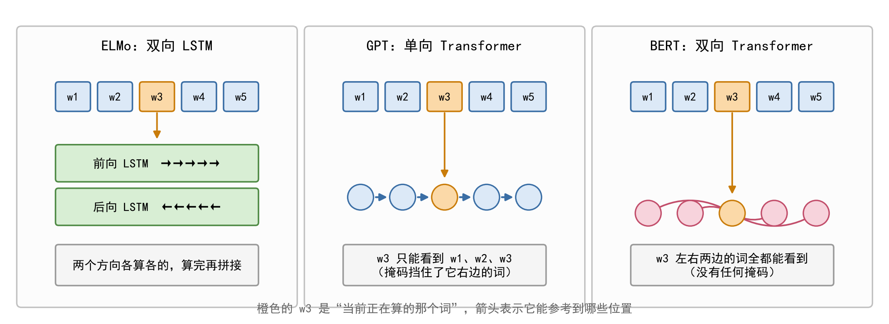
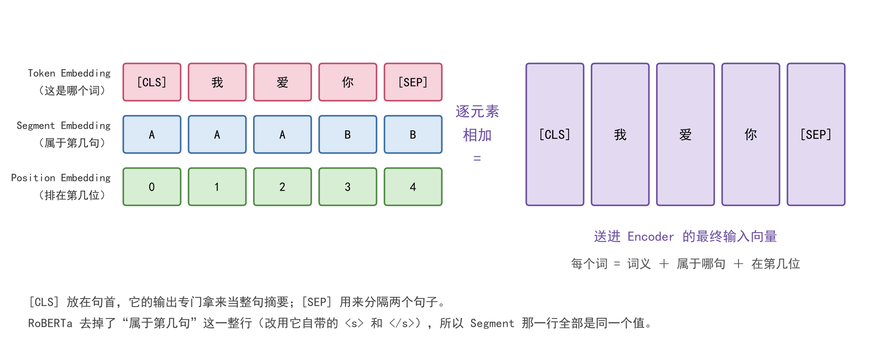
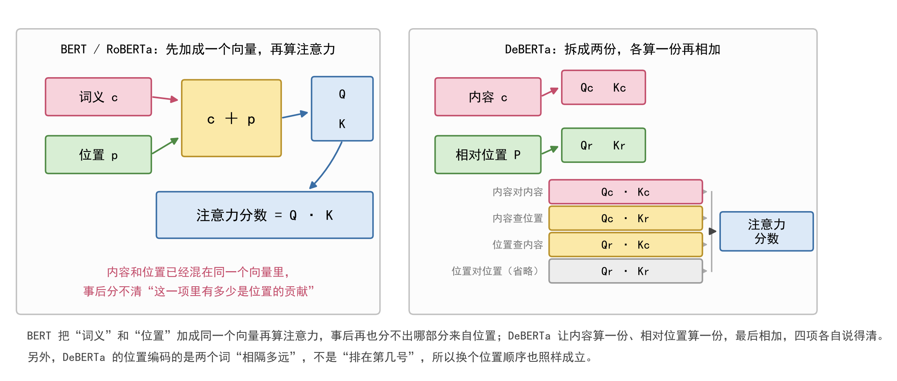

# BERT / RoBERTa / DeBERTa 原理详解

> 这三个模型是同一套 Transformer 编码器的三种配方。**看懂了[01 文档](01-Transformer原理详解.md)里的那张架构图，这一篇就只是"往那几个方块里填不同的东西"。**
>
> 配套文档：[01-Transformer 原理详解](01-Transformer原理详解.md) ｜ [03-LoRA 原理详解](03-LoRA原理详解.md)

---

## 零、先把这三个和 GPT、ELMo 分清楚

这三个（含 GPT）都是"预训练语言模型"，但**看上下文的姿势**完全不同：



| | ELMo（2018） | GPT | BERT |
| ---- | ---- | ---- | ---- |
| 骨干 | 双向 LSTM | Transformer **解码器** | Transformer **编码器** |
| 怎么看上下文 | 左到右、右到左**各跑一遍再拼接** | **只能看左边** | **左右都能看** |
| 两个方向交流吗 | **不交流**，各算各的 | 只有一个方向 | **每一层都在交流** |
| 擅长 | 提供词向量 | 生成（写下去） | 理解（分类、抽取） |

**关键差别在第三行**：ELMo 虽然叫"双向"，但两个方向是**各自独立**跑完再拼起来的，前向 LSTM 从头到尾不知道后向 LSTM 算出了什么。BERT 不一样 —— 它在**每一层**里都让每个词同时看到左右两边，信息是真交流的。

这就是为什么本实验做的是**分类任务**，选的是 BERT 这条线（编码器），而不是 GPT 那条线（解码器）。

---

## 一、BERT：教会模型"看上下文"

### 1.1 它要解决什么问题

Word2Vec、GloVe 这类**静态**词向量，给每个词发的是一张**固定的"语义快照"**：

- 句子1："我吃了**苹果**。" → `apple` 偏向食物语义；
- 句子2："我买了**苹果**手机。" → 同一个 `apple`，本该偏向科技产品语义。

但静态词向量表里只有一个 `apple`，两句话查到的是同一个向量，**分不开**。

BERT 的目标就是把这个"固定的快照"换成**随上下文流动的向量**：同一个词在不同句子里得到不同的表示。

**它的做法不是改模型结构，而是换个训练任务。** 结构上它就是 Transformer 的编码器堆 12 层，没什么新东西；真正的创新是下面两个"预训练任务"。

### 1.2 BERT 的输入长什么样



一个词进入 BERT 之前，会被表示成**三个向量相加**：

| 组成部分 | 回答的问题 | 说明 |
| ---- | ---- | ---- |
| **Token Embedding** | 这是哪个词 | 用 WordPiece 分词，词表 30522 |
| **Segment Embedding** | 属于第几句 | 只有两个值（A 句 / B 句） |
| **Position Embedding** | 排在第几位 | 可学习的绝对位置表，上限 512 |

两个特殊符号：

- `[CLS]` 放在句首，**它的输出专门拿来当整句的摘要**（分类时只用它）；
- `[SEP]` 用来分隔两个句子。

**WordPiece 分词是什么**：它猜不出"playing"这个词怎么办？拆成 `play` + `##ing`。常见词占一个 token，罕见词拆成几个常见片段。好处是**词表不会爆炸，也几乎不会出现"[UNK] 不认识"**。

### 1.3 编码器长什么样

就是[01 文档](01-Transformer原理详解.md)里那张图的**左半边**：词嵌入 → 位置编码 → 多头自注意力 → Add&Norm → FFN → Add&Norm，堆 12 层。

（其中 Add&Norm 里的**残差连接**和**层归一化**、以及那个 **FFN**，各自解决什么问题、少一个会怎样，见 [01 文档](01-Transformer原理详解.md) 第七节。）

| 版本 | 层数 | 隐藏维度 | 头数 | 参数量 |
| ---- | ---- | ---- | ---- | ---- |
| BERT-base | 12 | 768 | 12 | 110M |
| BERT-large | 24 | 1024 | 16 | 340M |

**"双向"在这里的含义**：不像 GPT 那样给注意力加因果掩码，BERT 的每个位置都能看到左右两侧的全部上下文（只屏蔽补零的 `[PAD]`）。所以同一个词在 12 层里被上下文反复改写，输出的是**动态上下文词向量** —— 一词多义就此解决。

**为什么 `[CLS]` 位置的输出能代表整句**：训练时 `[CLS]` 后面的所有 token 它都"见过"，注意力机制会把整句信息不断往它身上聚合，它自然而然成了整句话的"摘要位"。

### 1.4 预训练任务一：MLM（掩码语言模型）

**做法**：随机挑出 15% 的 token 让模型去猜。但不是全部换成 `[MASK]`，而是按 **80 / 10 / 10** 分配：

| 比例 | 怎么处理这个位置 |
| ---- | ---- |
| 80% | 换成 `[MASK]` |
| 10% | 换成一个**随机的词** |
| 10% | **保持原样不动** |

**为什么搞得这么绕？** 因为**微调阶段输入里根本没有 `[MASK]` 这个符号**。如果预训练全靠 `[MASK]` 出题，模型会学会"只对带 `[MASK]` 的位置认真"，而真实文本里没有这个标记 —— 预训练和下游任务之间就产生了不匹配。

那 10% 随机词 + 10% 保持原样，作用是**逼模型对每一个位置都保持警惕**，不能只盯着 `[MASK]`。

**MLM 是 BERT 能"双向"的关键**：因为要猜中间被盖住的词，模型必须同时利用左边和右边的信息。这比"预测下一个词"那种单向任务能学到更丰富的语境。

### 1.5 预训练任务二：NSP（下一句预测）

**做法**：给模型一对句子 A 和 B，判断 B 是不是 A 在原文里的下一句。

- 正样本（IsNext）：真的是相邻的两句；
- 负样本（NotNext）：B 是从别的文档里随机抽的。

**目的**：让模型理解句子间的逻辑关系（因果、顺承、转折），为问答、文本蕴含这类需要"篇章级理解"的任务打基础。

**但这个任务后来被证明设计得不好** —— 详见下面 RoBERTa 一节。

### 1.6 微调：怎么用到具体任务上

预训练完成后，模型已经"懂语言"了。接下来针对具体任务（比如本实验的情感二分类）做**微调**：

1. 把预训练好的 BERT 权重加载进来；
2. 在 `[CLS]` 的输出上面**挂一个随机初始化的小分类头**（一个线性层，768 → 2）；
3. 用标注数据（IMDB 的 25000 条训练样本）继续训练，**所有参数一起更新**（这叫全量微调）。

**这一步的性价比极高**：因为模型已经懂语言了，只需要很少的标注数据就能适配新任务。这就是"预训练 + 微调"这套两阶段范式改变整个 NLP 领域的原因。

> **要留意一个现象**：加载模型时会看到 Hugging Face 的警告 "Some weights were not initialized... you should probably TRAIN this model"。这是正常的 —— 主干是预训练好的，而新挂的分类头是随机的，本来就需要靠微调学出来。

### 1.7 BERT 的局限

- 位置编码是**绝对位置**，超过预训练见过的最大长度（512）就失效；
- NSP 任务设计不佳；
- 训练数据只有 16GB，按后来的标准看**严重不足**（见下一节）。

---

## 二、RoBERTa：一个字都没改结构，只改了配方

**RoBERTa = "Robustly optimized BERT approach"**，Meta 出品。

**先把最重要的一点说清楚：它的模型结构和 BERT 几乎完全一样** —— 同样是 Transformer 编码器堆叠、同样拿 `[CLS]` 当句子表征、同样用绝对位置编码。差别集中在**训练配方**和**词表**上。

所以这一节的价值，是提供了一个**"架构不动、只换训练方法"的对照**。

### 2.1 和 BERT 的差别，一条条对

| 区别 | BERT-base | RoBERTa-large | 在 config / 代码里的体现 |
| ---- | ---- | ---- | ---- |
| 预训练任务 | MLM + NSP | 只保留 MLM，**去掉 NSP** | `type_vocab_size` 由 2 变成 1 |
| 分词器 | WordPiece | 字节级 BPE | `vocab_size` 由 30522 变成 50265 |
| `pad_token_id` | 0 | **1** | BERT 的 0 是 `[PAD]`；**RoBERTa 的 0 是 `<s>`，1 才是 `<pad>`** |
| 掩码方式 | 静态：预处理时盖一次 | 动态：每个 epoch 重新采样 | 代码里体现为掩码交给模型内部做 |
| 训练数据与步数 | 16GB 语料 | 160GB 语料、更大 batch、训练更久 | 权重里看不出来，但这是效果差异的**主因** |
| 位置编码 | 绝对位置 | 绝对位置（和 BERT 相同） | `max_position_embeddings` = 514 |
| 规模（large） | 110M（base） | **355M** | 24 层、hidden 1024 |

> **一个最容易静默出错的地方：pad id 变了。**
> 如果沿用 BERT 那套把 `pad_token_id` 写死成 0 的代码，RoBERTa 的句首符号 `<s>`（ID = 0）会被当成 pad 屏蔽掉，而真正的 pad 又没被屏蔽 —— 注意力会算到补零的位置上。**它不报错，只是效果变差**，非常难查。
> 所以本实验的实现一律从 `model.config` / `tokenizer` 里取这些 ID，不写死。

### 2.2 为什么换成字节级 BPE

BPE 的思路是"从字符出发，反复把语料里出现频率最高的相邻符号对合并成一个新符号"，合并够多次就得到词表。

字节级 BPE 有两个实际好处：

1. **永远不会出现 `[UNK]`** —— 任何字符（包括 emoji、拼错的词、罕见人名）最差也能拆到字节级别，一定能被表示；
2. **常用词占一个 token、罕见词被拆成几个常见片段**，兼顾词表大小和覆盖率。

**对 IMDB 这种任务尤其重要**：影评里口语缩写、否定词（`don't`、`wasn't`）很多。子词切分能把 `don't` 稳定切成 `don` + `'t`，这对情感判断是关键 —— **否定词一旦被切碎或丢失，句子的极性就反了。**

### 2.3 为什么去掉 NSP

后来的研究发现 NSP 这个任务**既太难又太简单**：

- 负样本是从**别的文档**里随机抽的，主题完全对不上；
- 于是模型只要判断"两句话讲的是不是同一件事"就能拿高分，**根本学不到真正的句间逻辑关系**。

RoBERTa 的消融实验证实去掉 NSP 后效果不降反升（或至少持平），于是干脆只保留 MLM。

这个改动在 config 里留下的痕迹非常直观：**`type_vocab_size` 从 2 变成 1** —— 不需要区分"这是第一句还是第二句"，句子类型嵌入自然就用不上了。

### 2.4 动态掩码 vs 静态掩码

- **静态**（原版 BERT）：在数据预处理阶段就把掩码盖好，同一个句子在**每个 epoch** 看到的被盖位置完全相同；
- **动态**（RoBERTa）：每个 epoch 重新采样一次掩码位置，同一句话每轮被"考"的地方都不一样。

动态掩码相当于一种数据增强，让模型见到的"考法"更多样，不容易死记硬背。

**不过要客观说一句**：论文里做过对照实验（准备了 40 种不同的静态掩码轮换使用作为基线），结果发现**动态与静态的差别其实并不大**。所以动态掩码**不是 RoBERTa 涨分的主因**，它的好处更多是实现上更自然（交给模型内部采样即可，不必预先造多份数据）。

### 2.5 真正的主因：更多数据、更大 batch、训练更久

RoBERTa 论文里最著名的一句话是：

> **"BERT was significantly undertrained"（BERT 严重训练不足）**

| | 语料 | batch size | 训练 |
| ---- | ---- | ---- | ---- |
| BERT | 16GB（BooksCorpus + 英文维基） | 256 | 相对短 |
| RoBERTa | **160GB（10 倍）** | **8K** | 明显更长 |

**这部分差别在权重文件和 config 里完全看不出来，只能从论文里读** —— 而这恰恰是 RoBERTa 分数更高的最主要原因。

这也解释了为什么本仓库里"只换一行 `MODEL_NAME`"就能涨点：**涨的不是代码，是那一行背后那份预训练权重。**

### 2.6 RoBERTa-large 的具体尺寸

| 项目 | 数值 | 说明 |
| ---- | ---- | ---- |
| 层数 | 24 | 架构图里的 `N` |
| 隐藏层维度 | 1024 | 每个 token 的向量长度 |
| 注意力头数 | 16 | 每头 1024 / 16 = 64 维 |
| 前馈网络中间层 | 4096 | 4 倍扩张 |
| 最大位置数 | 514 | 绝对位置嵌入 |
| 参数量 | 约 355M | 约是 BERT-base 的 3.2 倍 |

**分类头结构**（`AutoModelForSequenceClassification` 自动挂上的）：

```
<s> 位置向量（1024）
   → Dropout
   → Linear(1024 → 1024)     ← 名字是 classifier.dense
   → tanh 激活
   → Dropout
   → Linear(1024 → 2)        ← 名字是 classifier.out_proj
   → logits（两个数值）
```

注意 RoBERTa 的分类头比 BERT 多一层（BERT 是直接 `Linear(768→2)`）。这是 RoBERTa 沿用自原始论文的实现细节。

### 2.7 本实验里的位置

本实验用 `roberta-large` 做**全量微调**（355M 个参数全部参与更新），拿到 **0.94828**。做法是：同一份代码只改配置区三行。

| 配置 | bert_native | roberta_large | 依据 |
| ---- | ---- | ---- | ---- |
| `MODEL_NAME` | `bert-base-uncased` | `roberta-large` | 换模型就是换这一行 |
| `BATCH_SIZE` | 8 | **4** | 355M 比 110M 大三倍，batch 得调小 |
| `LEARNING_RATE` | 5e-5 | **1e-5** | 模型越大，学习率要越小 |

---

## 三、DeBERTa：真正改了注意力算法

**DeBERTa = "Decoding-enhanced BERT with Disentangled Attention"**，微软出品。这是三个里**唯一真的动了架构**的一个。

### 3.1 先说 BERT / RoBERTa 的位置信息是怎么给的

做法很直接：查一张"第几号位置 → 一个向量"的表，把这个位置向量**加到**词向量上，然后送进注意力层。

于是注意力在计算相关性时，用的是 `词义 + 位置` 混合在一起的向量 —— **内容和位置是纠缠的**。

这带来一个问题：你没办法说清"这次注意力里，有多少分是词义贡献的、多少分是位置贡献的"。

### 3.2 解耦注意力（Disentangled Attention）

DeBERTa 把每个 token 的表示**拆成两份**：

- 一份是**纯内容向量** $c$；
- 一份是**相对位置向量** $P$ —— 注意，编码的不是"在第几位"，而是"**和对方隔了多少个 token**"。

Query 和 Key 也各自有内容和位置两套投影（记作 $Q^c, K^c$ 与 $Q^r, K^r$），注意力分数由**四项相加**得到：

$$
A_{i,j} = Q^c_i K^{c\top}_j + Q^c_i K^{r\top}_{i,j} + Q^r_{j,i} K^{c\top}_j + Q^r_{j,i} K^{r\top}_{i,j}
$$

四项的含义（$\top$ 表示转置，$i$、$j$ 是两个 token 的位置）：

| 这一项 | 含义 | 说人话 |
| ---- | ---- | ---- |
| $Q^c_i K^{c\top}_j$ | **内容 → 内容** | 两个词的语义有多相关 |
| $Q^c_i K^{r\top}_{i,j}$ | **内容 → 位置** | 第 $i$ 个词的内容，和"它跟第 $j$ 个词隔多远"这件事有多相关 |
| $Q^r_{j,i} K^{c\top}_j$ | **位置 → 内容** | 反过来，位置信息去查第 $j$ 个词的内容 |
| $Q^r_{j,i} K^{r\top}_{i,j}$ | **位置 → 位置** | 纯位置之间的匹配 |



（论文实际实现时把第 4 项省略了 —— 它对最终效果贡献很小，去掉能省不少计算量。）

### 3.3 相对位置带来的三个好处

1. **编码的是"距离"而不是"编号"。** `我/很/喜欢/这个/电影` 和 `这个/电影/我/很/喜欢` 里，"喜欢"和"电影"的相对距离是一样的。模型学到的是这种**与绝对位置无关的关系**，可以直接迁移到训练时没见过的位置。
2. **对长文本更宽容。** 绝对位置一旦超过预训练见过的最大长度就失效，相对位置没有这个硬上限。
3. **和情感分类直接相关。** 情感词和它修饰对象的距离关系（比如 `not ... good` 这种隔着几个词的否定）用相对位置来建模更自然。

### 3.4 增强掩码解码器（Enhanced Mask Decoder）

**模型名字里的 "Decoding-enhanced" 指的就是它。**

问题在于：相对位置只知道"离多远"，不知道"这句话从哪儿开始"。做 MLM 填空时，光凭相对距离有时候确定不了该填什么 —— 比如判断一个词是不是处在句首。

DeBERTa 的解决办法是：**在最后一步做预测之前，把绝对位置信息重新加回隐藏层表示**，再送去 softmax。

这样注意力阶段用相对位置、解码阶段用绝对位置，两边的好处都占了。

**这个模块在权重文件里的痕迹是 `lm_predictions.*` 那一组权重** —— 它只在预训练的 MLM 阶段用得到，做分类微调时用不上，所以加载时会报 `UNEXPECTED`，属于正常现象。

### 3.5 没有句子类型嵌入

和 RoBERTa 一样，DeBERTa 也去掉了 NSP 任务，所以 **`type_vocab_size = 0`**（BERT 是 2，RoBERTa 是 1）。

### 3.6 两个尺寸

| 版本 | 层数 | 隐藏维度 | 参数量 |
| ---- | ---- | ---- | ---- |
| deberta-v2-**xlarge** | 24 | 1536 | 约 900M |
| deberta-v2-**xxlarge** | **48** | 1536 | 约 1566.9M（1.5B） |

本实验用的是 xxlarge。

> **记一个踩过的坑：`microsoft/deberta-v2-large` 这个模型不存在。**
> DeBERTa-v2 只发布了 xlarge 和 xxlarge 两个档，"large" 是 DeBERTa **v1** 的档位。写错会直接报 `RepositoryNotFoundError`。

### 3.7 本实验里的位置

xxlarge 有 1.5B 参数，**在 Kaggle 的单张 T4 上全量微调必然失敗**（原因见 [03 文档](03-LoRA原理详解.md)），所以这一条腿改用 LoRA，最终拿到 **0.97044**，是本实验 16 个模型里的最高分。

---

## 四、三个模型放在一起看

### 4.1 结构上的差别

| 区别 | BERT | RoBERTa | DeBERTa |
| ---- | ---- | ---- | ---- |
| 位置信息 | 绝对位置向量**加进**词向量 | 和 BERT 相同 | **解耦注意力**：内容与相对位置分离，四项相加 |
| config 痕迹 | 无相对位置字段 | `max_position_embeddings = 514` | `relative_attention=True`、`position_biased_input=False` |
| 预训练任务 | MLM + NSP | 只保留 MLM | 只保留 MLM |
| 句子类型嵌入 | 有（2 行） | 1 行 | **没有**（`type_vocab_size=0`） |
| 掩码解码器 | 无 | 无 | **有**（增强掩码解码器，`lm_predictions.*`） |
| 分词器 | WordPiece（30522） | 字节级 BPE（50265） | 字节级 BPE |
| `pad_token_id` | 0 | 1 | 0 |

### 4.2 一句话区分三者

- **BERT**：提出"预训练 + 微调"这套范式，用 MLM 让编码器学会双向看上下文；
- **RoBERTa**：**架构一个字没改**，靠更多数据、更大 batch、去掉 NSP、换 BPE 词表，把 BERT 训得更充分；
- **DeBERTa**：**真的改了架构**，把"内容"和"位置"拆开算注意力，让位置信息用"相对距离"而不是"绝对编号"。

### 4.3 本实验的分数落在哪

| 模型 | 测试集准确率 | 说明 |
| ---- | ---- | ---- |
| BERT（手动训练循环） | 0.91692 | 全量微调 |
| BERT（自定义分类头） | 0.91948 | 全量微调 |
| DistilBERT + Trainer | 0.92968 | 全量微调（67M，蒸馏版） |
| BERT + Trainer | 0.93884 | 全量微调 |
| **RoBERTa-large** | **0.94828** | 全量微调（355M） |
| **DeBERTa-v2-xxlarge + LoRA** | **0.97044** | **参数高效微调（1.5B）** |

**从 0.917 到 0.970，这 5.4 个百分点是怎么来的**，可以拆成两段：

- **BERT → RoBERTa（+3.1pp）**：结构没变，涨的是**预训练配方**。这条最反直觉，也最能说明问题 —— 它证明了**架构本身不值钱，值钱的把模型训充分**。
- **RoBERTa → DeBERTa（+2.2pp）**：这次既涨了规模（355M → 1.5B），也换了位置编码机制（绝对 → 相对 + 解耦）。

### 4.4 一个必须记住的对照

本仓库里还有两个"纯 Transformer"的分数，放在一起看特别有说服力：

| 模型 | 编码器 | 预训练 | 分数 |
| ---- | ---- | ---- | ---- |
| GloVe + Transformer | 2 层，从头训 | **没有** | 0.84184 |
| BERT（手动循环） | 12 层 | **有**（3.3B 词） | 0.91692 |

**同样的注意力机制、同样的骨架，一个 0.84 一个 0.92 —— 差的不是结构，是有没有预训练。**

再补一条佐证：本仓库里那个从头训的 Transformer 甚至比 GloVe + LSTM（0.89420）还低。原因是 Transformer **天生不带任何关于语言的假设**（CNN 知道"挨着的词有关系"，LSTM 知道"词是按顺序来的"），这些常识它都得从 25000 条影评里现学 —— 数据量根本不够。

**所以这条线的逻辑是：Transformer 提供能力，预训练注入知识，两者缺一不可。**
