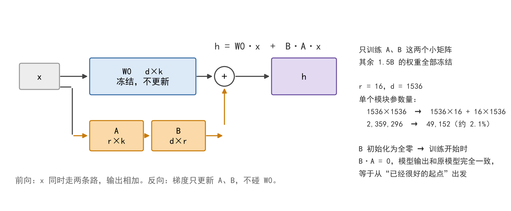

# LoRA 原理详解

> LoRA 是一种**参数高效微调（PEFT）**方法。它不改模型结构、不改训练目标，只解决一个非常具体的问题：**模型太大，全量微调装不进显卡。**
>
> 配套文档：[01-Transformer 原理详解](01-Transformer原理详解.md) ｜ [02-BERT / RoBERTa / DeBERTa 原理详解](02-BERT-RoBERTa-DeBERTa原理详解.md)

---

## 一、为什么需要 LoRA：先算一笔显存账

本实验要用 `microsoft/deberta-v2-xxlarge`，**1566.9M 个参数（约 1.5B）**。

### 1.1 全量微调时，每个参数要占 16 个字节

这不是"模型大小 = 参数量 × 4 字节"那么简单。训练时除了权重本身，还要额外存梯度和优化器状态：

| 项目 | 每个参数占多少 | 是什么 |
| ---- | ---- | ---- |
| 权重（fp32） | 4 字节 | 模型本身 |
| 梯度 | 4 字节 | 反向传播时算出来的 |
| AdamW 一阶动量 `exp_avg` | 4 字节 | 优化器记的"历史平均方向" |
| AdamW 二阶动量 `exp_avg_sq` | 4 字节 | 优化器记的"历史波动幅度" |
| **合计** | **16 字节** | |

于是：

```
1566.9e6 × 16 B = 25.07e9 B ≈ 23.35 GB
而一张 T4 可用显存只有 14.56 GB
→ 缺口 8.79 GB，必然 OOM
```

DeBERTa-v2 的两个尺寸都装不下：

| 模型 | 参数量 | 全量微调固定开销 | T4（14.56 GB） |
| ---- | ---- | ---- | ---- |
| deberta-v2-xlarge | 900M | 13.41 GB | 超 |
| deberta-v2-xxlarge | 1566.9M | **23.35 GB** | **超 8.79 GB** |

> 上表单位是 GiB（按 1024 换算），下同。

### 1.2 最关键的一点：这 16 字节和 batch 无关

**"把 batch 调小一点"救不了。** 因为这 16 字节只跟**参数量**成正比，跟一次喂多少条数据没关系。batch 调小只减掉"激活值"那一项，权重、梯度、优化器状态三座大山一动不动。

**fp16 混合精度也救不了。** 因为参数、梯度、优化器状态这三项**仍然全是 fp32**（混合精度只让前向计算走 fp16，不改变参数存储）。

本实验专门留了一个取证脚本 `imdb_deberta_v2_xxlarge_oom_demo.py`：把 batch_size 直接写成 **1**（能调到的最小值），跑出来照样 OOM。它专门用来堵住"你把 batch 调小点不就行了"这句话 —— **batch = 1 照样死，因为死因跟 batch 无关。**

既然装不下，就只剩一条路：**减少"需要训练"的参数数量。** 这就是 LoRA 的出发点。

---

## 二、LoRA 的核心想法

**一句话：冻结预训练权重 $W_0$，只在旁边学一小块"低秩增量" $\Delta W$，让 $W = W_0 + \Delta W$。**



### 2.1 数学形式

对一个原本 $d \times k$ 的权重矩阵 $W_0$，LoRA **不去直接学** $\Delta W$（那样参数量和全量微调一样大），而是把它**分解成两个瘦矩阵的乘积**：

$$
\Delta W = BA,\qquad A \in \mathbb{R}^{r\times k},\ B \in \mathbb{R}^{d\times r},\quad r \ll \min(d,k)
$$

前向计算随之变成：

$$
h = W_0 x + \Delta W x = W_0 x + BAx
$$

$r$ 叫**秩（rank）**，是这里唯一的"旋钮"。$r$ 取得越小，省得越多，能改变的幅度也越小。

### 2.2 这两个瘦矩阵各自在干什么

**A 和 B 不是随便拆出来的，它们分工很明确：A 负责"挑方向"，B 负责"铺回去"。**

拿本实验的 `query_proj` 举例（原本是一个 1536 × 1536 的大矩阵）。

**A 做的事 —— 把 1536 维压成 16 维**

```
x          1536 维
   ↓ 乘 A      A 的形状：16 × 1536
A·x          16 维      ← 被压扁了
```

**它问的是："这次改动，可以往哪 16 个方向走？"**

**B 做的事 —— 把 16 维升回 1536 维**

```
A·x          16 维
   ↓ 乘 B      B 的形状：1536 × 16
B·A·x       1536 维     ← 又变回来了
```

**它答的是："刚才挑出来的那 16 个方向，分别要在原来的 1536 个维度上占多少分量？"**

**合起来看 —— 两条路并排走，最后相加：**

```
完整结果  =  W0·x   +   B·A·x
              ↑           ↑
          冻结不动      可训练
```

### 2.3 为什么非要过这道 16 维的窄口

因为改动被硬性限制在**最多 16 个独立方向**里 —— 这就是"低秩"三个字的意思，秩 = 16。

反过来想想就清楚了：如果把 $\Delta W$ 当成一个完全自由的 1536 × 1536 矩阵，那它能表达 1536 个方向，**参数量和全量微调一模一样，LoRA 就没有任何意义了。**

**LoRA 押的是一个假设：微调真正需要改的地方，本来就没那么复杂，16 个方向够用了。** 这个假设在这类下游任务上被反复验证 —— 它是 LoRA 能成立的全部前提。

### 2.4 一个很容易误解的地方：代码里从来不真的算 BA

直觉上会以为要"先算出 $BA$ 这个 1536 × 1536 的大矩阵，再拿它去乘 $x$"。

**但那样反而亏了** —— 把 $BA$ 显式算出来，本身就要 $1536 \times 1536 \times 16$ 次乘法。

实际走的是这条小路，一步一步来：

```
x → A        每算一个词：1536 × 16 ≈ 2.5 万次
A·x → B      每算一个词：16 × 1536 ≈ 2.5 万次

合计                               ≈ 5 万次

而「先算出 BA 再乘 x」             ≈ 3778 万次
```

**差了整整 768 倍。** 所以"低秩"不只是省参数，**同时还省计算** —— 这是拆成两个瘦矩阵的额外好处。

$BA$ 这个乘积**只在最后合并的时候才算一次**（见第六节的 `merge_and_unload`）。

> 反过来说：**如果不合并，这条小路每步推理都得多走一遍。** 那点开销很小，但不是零 —— 所以第六节说的"推理零额外开销"，前提是**已经合并**。

### 2.5 梯度只流进 A 和 B

$W_0$ 那边被冻住了，反向传播传到它就停，不会再往下走。

所以优化器要记的一阶动量、二阶动量，也只有这 49,152 个数的份。**这就是显存能省下 17.5 GB 的全部原因**（见第五节那张表）。

### 2.6 两个初始化，为什么很关键

| 矩阵 | 怎么初始化 | 为什么 |
| ---- | ---- | ---- |
| $A$ | 随机（高斯）初始化 | 需要一点随机性来打破对称 |
| $B$ | **全零** | 让训练刚开始时 $BA = 0$ |

**$B$ 初始化为全零这一步是设计上的点睛之笔**：训练刚开始时 $BA = 0$，模型的输出和原始预训练模型**完全一致**。

这相当于**从一个已经很好的起点出发，只去学"还差多少"**，而不是像随机初始化那样，一上来就把预训练学到的东西破坏掉再重建。

### 2.7 参数量到底省了多少

按本实验的 $r = 16$、$d = 1536$ 算：

| | 原来的 $W_0$ | LoRA 的 $A$ 和 $B$ |
| ---- | ---- | ---- |
| 形状 | 1536 × 1536 | 1536 × 16 和 16 × 1536 |
| 参数个数 | 2,359,296 | **49,152** |
| 占比 | 100% | **约 2.1%** |

这个比例可以写成一个公式：

$$
\frac{2r}{d} = \frac{2\times 16}{1536} \approx 2.1\%
$$

**rank（$r$）越小，省得越多** —— 这就是"低秩"三个字的由来。

同样的理由，这个推法也解释了为什么 $B$ 和 $A$ 要那么瘦：**把一个 $1536\times 1536$ 的大矩阵，用"$1536\times 16$ 再乘 $16\times 1536$"来近似。** 中间那道 16 维的瓶颈，强迫模型只能用很少的几个"方向"去表达改动 —— 而实验发现，微调真正需要的改动，本来就没那么复杂。

### 2.8 本实验的总账

本实验在 48 层里、每层挂 `query_proj` / `key_proj` / `value_proj` 三个矩阵，一共 **144 个模块**：

```
144 × 49,152 = 7,077,888 ≈ 7.1M
```

占 1.5B 总参数的 **0.45%**。

**换句话说：需要训练的参数从 15.7 亿降到了 710 万。**

---

## 三、挂在哪几个矩阵上（`target_modules`）

LoRA 不会给模型里每一个矩阵都挂一份。理论上挂在哪儿都行，实践中有个常用的权衡。

peft 内置了一张"模型 → 推荐挂载位置"的对照表，对 `deberta-v2` 给出的是 `query_proj` 和 `value_proj`；本实验**额外把 `key_proj` 也挂上**，让注意力的三条投影都参与调整。

| 挂法 | 参数量 | 取舍 |
| ---- | ---- | ---- |
| 只挂 `query_proj`、`value_proj` | 最省 | 社区默认做法，效果已经不错 |
| 挂 `query_proj`、`key_proj`、`value_proj` | 略多 | **本实验采用**，注意力内部三条投影都能调 |
| 再往上加 FFN（`intermediate.dense` / `output.dense`） | 翻几倍 | 效果可能再好一点，但 FFN 占了模型三分之二的参数，挂上去就失去"参数高效"的意义了 |

**一句话：挂在注意力层性价比最高** —— 注意力负责"词与词之间怎么关联"，而这正是下游任务最需要改的部分。

（回顾 [01 文档](01-Transformer原理详解.md) 第七节 7.3：FFN 大约占了注意力 + FFN 总参数的三分之二 —— 在 deberta-v2-xxlarge 上就是 **906M**。所以"不挂 FFN"这个选择，省下来的参数量非常可观。）

---

## 四、另外两个参数：`lora_alpha` 和 `lora_dropout`

### 4.1 `lora_alpha`

本实验设 `lora_alpha = 32`。但真正参与前向计算的其实不是 $\Delta W$，而是：

$$
\Delta W \times \frac{\alpha}{r} = \Delta W \times \frac{32}{16} = \Delta W \times 2
$$

相当于给 LoRA 分支**单独乘了一个放大系数 2**。

**它的价值在于：让"更新的力度"可以独立于 $r$ 调节。**

- 想改 $r$（改参数量）的时候，不用重新调学习率；
- $\alpha / r$ 调大，等价于变相提高 LoRA 部分的等效学习率。

### 4.2 `lora_dropout`

本实验设 `lora_dropout = 0.05`：在 LoRA 分支的输入上做 dropout，**防止这 7M 参数在小数据集上过拟合**。

### 4.3 `bias = "none"`

偏置项一律**不训练、保持冻结**。少一部分参数，也少一份过拟合风险。

---

## 五、为什么 LoRA 能把显存压下来

回到开头那笔 16 字节的账。显存的大头是**权重、梯度、优化器状态**三项，其中**梯度**和**优化器状态**都是和"要训练的参数个数"成正比的。

LoRA 把可训练参数从 15.7 亿砍到 710 万，于是：

| 项目 | 全量微调 | **LoRA** |
| ---- | ---- | ---- |
| 权重（仍需完整读进显存） | 1566.9M × 4B = 5.84 GB | 5.84 GB（冻结，不变） |
| 梯度 | 1566.9M × 4B = 5.84 GB | 7.1M × 4B = **0.03 GB** |
| AdamW 优化器状态 | 1566.9M × 8B = 11.68 GB | 7.1M × 8B = **0.06 GB** |
| **合计（不含激活值）** | **23.35 GB** | **5.93 GB** |

> **注意第一行并没有省。** 1.5B 的模型还是要**完整地装进显存**，只是它不参与更新。
> **LoRA 省掉的是"梯度 + 优化器状态"那 17.5 GB** —— 不是模型本身。

再算上激活值：

```
权重        1566.9M × 4 B  =  5.84 GB   ← 还在显存里，只是不参与更新
梯度           7.1M × 4 B  =  0.03 GB   ← 只给 A、B 算
优化器状态     7.1M × 8 B  =  0.06 GB   ← 只给 A、B 记账
激活值                     ≈  2 GB      ← 靠梯度检查点压下来
────────────────────────────────────────
合计                       ≈  8 GB      ← T4（14.56 GB）装得下
```

**固定开销从 23.35 GB 压到 8 GB 上下。**

需要说清楚的是，这 8 GB 是靠**三条措施各管一块**换来的，缺一不可：

| 措施 | 砍掉哪一块显存 | 原理 |
| ---- | ---- | ---- |
| ① **LoRA** | 梯度 + 优化器状态 | 只有 7.1M 参数参与训练 |
| ② **梯度检查点** | 激活值 | 前向时不存中间结果，反向时重算一遍，用时间换显存 |
| ③ 梯度累积 | **什么也不省** | 它是为了"训练效果"，不是"省显存" |

> ⚠️ **别把 ③ 和 ①② 混为一谈。** 梯度累积的唯一作用，是让"小 batch 攒出来的梯度"等价于"大 batch 一步算出来的梯度"，用来模拟更大的 batch。

**LoRA 单独并不够。** 本实验第一趟只挂了 LoRA 没开梯度检查点，激活值就有十几个 G。这一点值得单独记住：**"能装下"是三条措施一起努力的结果，不是 LoRA 一个人的功劳。**

---

## 六、推理时可以合回去，不增加任何延迟

训练完之后，可以把 $\Delta W = BA$ **直接加回** $W_0$：

$$
W = W_0 + BA
$$

这对应 peft 里的 `merge_and_unload()`。合并之后得到的是一个**结构和原来完全相同**的模型，推理速度和全量微调的模型**一模一样**。

**这一点是 LoRA 比 Prefix-Tuning / P-Tuning 那一类方法更实用的地方。** 后者是"往输入里塞虚拟 token"，这些虚拟 token 会**占掉序列长度**，推理时每一步都要多算 —— **是一笔持续的开销**，而且永远合并不掉。

| 方法 | 推理时有没有额外开销 | 能不能合并回去 |
| ---- | ---- | ---- |
| **LoRA / AdaLoRA** | **没有** | **能**（`merge_and_unload`） |
| Prefix-Tuning | 有（虚拟 token 占序列长度） | 不能 |
| P-Tuning | 有（同上） | 不能 |
| Adapter（串行插入层） | 有（多了几层） | 不能 |

---

## 七、产物是什么

`save_pretrained` 保存下来的**只有 $A$、$B$ 两个小矩阵和分类头**，体积约几 MB —— 而不是 5.84 GB 的完整权重。

**这个性质的实际意义很大**：换一台机器、换一个 Kaggle 会话，只要把 adapter 装回**同一个基础模型**就能复现结果，**不用重训**。

本实验正是靠这一点，才敢把"**先存 adapter、再预测**"写进流程 —— 万一训练跑完但预测时被 Kaggle 的 12 小时会话上限掐掉，adapter 还在，开个新会话就能直接出结果。

---

## 八、和另外三种 PEFT 方法对比

本实验的老师提供了四份模板，骨架完全相同（tokenizer → 分词 → `DataCollatorWithPadding` → `AutoModelForSequenceClassification` → `get_peft_model` → `Trainer` → 预测 → 出 csv），**差别只在配置区那一个 peft 配置类**：

| 模板 | 挂什么 | 方法本身在 DeBERTa-v2 + 本环境上能不能用 |
| ---- | ---- | ---- |
| `imdb_deberta_lora.py` | `LoraConfig`（r=16, alpha=32） | ✅ **可用，本实验采用** |
| `imdb_deberta_adalora.py` | `AdaLoraConfig` | ✅ 可用（另一种低秩方案，未采用） |
| `imdb_deberta_prefix.py` | `PrefixTuningConfig` | ❌ DeBERTa-v2 上不可用 |
| `imdb_deberta_ptuning.py` | `PromptEncoderConfig` | ❌ 在 peft 0.19.1 上 import 就报错 |

后两个为什么用不了，都查证过：

**Prefix Tuning 走的是 KV cache。** peft 的 `_prefix_tuning_forward` 会把虚拟 token 拼进 `past_key_values` 传给模型，拿不到就抛：

```
ValueError: Model does not support past key values which are required for prefix tuning.
```

而 transformers 5.0 的 `modeling_deberta_v2.py` 里 **`past_key_values` 一次都没出现** —— DeBERTa-v2 在这个版本里根本没有 KV cache。**这不是配置问题，是方法本身对不上。**

**P-Tuning 那份文件在第 12 行就挂了**：

```python
from peft import ... prepare_model_for_int8_training
```

这个名字在 peft 0.19.1 里已经被删掉（只剩 `prepare_model_for_kbit_training`），import 阶段直接 `ImportError`，**连模型都加载不到**。

---

## 九、LoRA 之外还必须配什么

**这一节是本实验踩坑最多的地方，也是"模型能跑起来 ≠ 模型在学"这句话的注解。**

挂上 LoRA 之后，模型确实能在 T4 上跑起来了，但第一趟**跑满两轮，验证准确率卡在 0.5104** —— 二分类里 0.51 约等于抛硬币。问题不在 LoRA，而在下面这几处：

| 问题 | 措施 | 为什么 |
| ---- | ---- | ---- |
| 分类头是随机初始化的，名字里没有 `lora_`，**被 peft 冻住了** | `LoraConfig(..., modules_to_save=[分类头])` | 不写这一条，顶上挂着一个永远不动的随机线性层，跑到天亮也是 0.5104 |
| 不开梯度检查点，激活值就有十几个 G | `gradient_checkpointing_enable()`，并**必须配套** `enable_input_require_grads()` | 漏了后者，每层 checkpoint 的输入不带梯度 → **编码器一个梯度都拿不到，等于只有分类头在训**。不报错，只是永远 50% |
| LoRA 和分类头用同一个学习率，但分类头初始权重尺度只有 0.02，lr 太小挪不动 | **学习率分两组**：LoRA 2e-4、分类头 1e-3 | Adam 每步不管梯度多小都要走 lr 那么远 |
| 模型自带的 `ContextPooler` 是个 1536×1536 的**随机矩阵**，不在预训练权重里 | 绕开它，前向改成**非 pad 位置的平均池化** | 等于在编码器和分类头之间夹了一层乱投影 |

**这几条加起来，把分数从 0.5104 拉到了 0.97044 —— 46 个百分点。**

中间没有换模型、没有加数据、没有堆算力，改的都是"**让已有的梯度真正流到该流的地方**"。

> 这一段单独拎出来说的原因是：**LoRA 本身只解决"装不下"，它不解决"学不动"。** 这是本实验最大的教训。

---

## 十、优缺点小结

**优点**

- **把 1.5B 的模型塞进了单张 T4**：固定开销从 23.35 GB 降到约 8 GB，这是全量微调做不到的；
- **只训练约 7.1M 参数（占总量 0.45%）**，产物是一个几 MB 的 adapter，想复现不用重训；
- **推理零额外开销**（能 `merge_and_unload` 合回原结构），比 Prefix / P-Tuning 更实用；
- **不引入任何推理延迟、不改变模型结构**，随时可以摘掉。

**缺点**

- **只训低秩旁路，能改变的幅度有限**。要吃满 LoRA 的效果需要足够的更新次数，而 Kaggle 的免费额度恰恰卡在这里；
- **训练速度慢**：单次更新以秒计，一轮就是小时级，必须靠**时间预算倒推步数**，而不是"跑够几轮"；
- **依赖链敏感**：transformers / peft / torchao 的版本一变就可能跑不起来（本实验踩到三处 API 变更）。

**一句话总结**：LoRA 用"把改动限制在一个低秩子空间里"这个假设，换来了 **30 倍的显存节省**和**几乎无损的效果**。它的前提是"微调本来就不需要改太多东西" —— 而这个前提，在这类下游任务上被反复验证是成立的。
